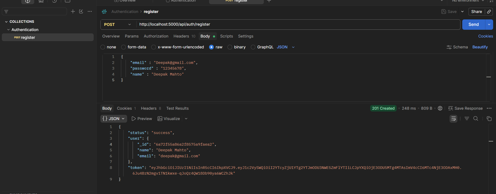
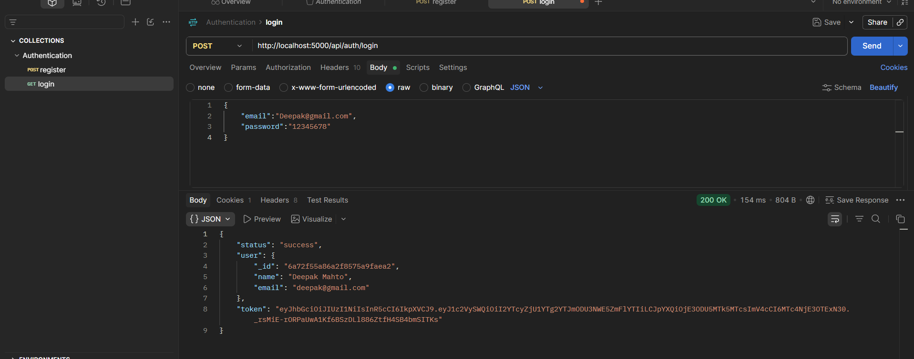
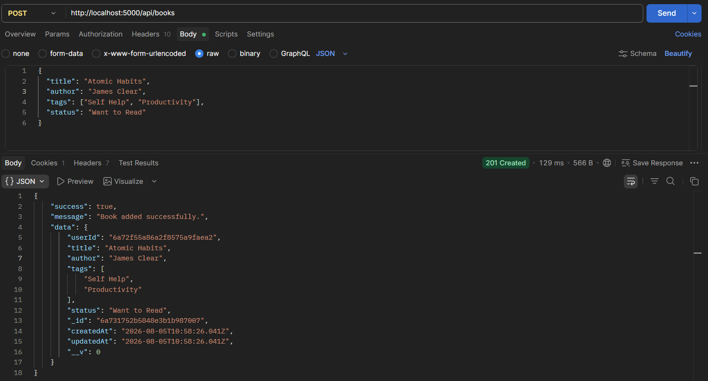
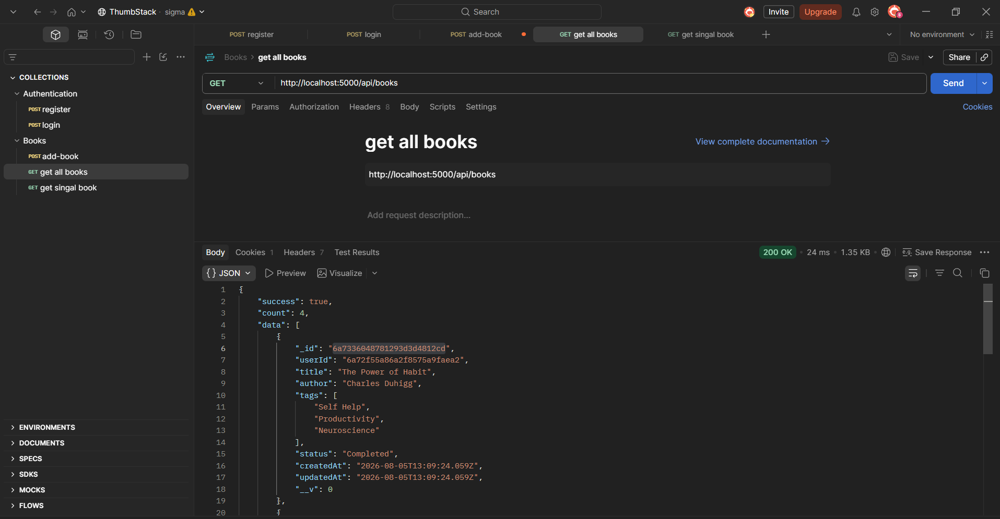
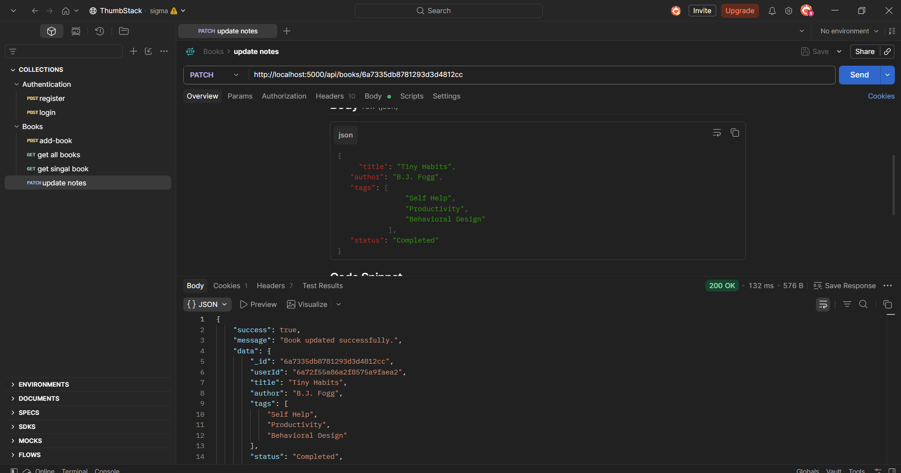
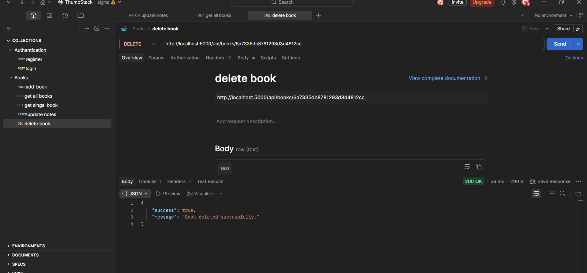

# ThumbStackTask 

# 📚 Personal Book Manager

A full-stack Personal Book Manager built using the MERN stack with Next.js as the frontend.

This project is being developed as part of the Thumbstack Full Stack Developer Assignment.

---

## -> Tech Stack

### Frontend
- Next.js
- React.js
- Tailwind CSS

### Backend
- Node.js
- Express.js
- MongoDB
- JWT Authentication
- bcrypt

---


## ✨ Planned Features

- User Registration
- User Login
- JWT Authentication
- Protected Routes
- Add Books
- Edit Books
- Delete Books
- Filter by Tags
- Filter by Reading Status
- Dashboard Statistics
- Responsive UI
- Dark Mode
- Smooth Animations

---


##  Backend Setup

### Current Features

- Express server initialized
- Modular application structure
- JSON middleware configured
- Ready for API routes
- Environment-based port configuration


## 📁 Backend Structure

- `server.js` – Starts the Express server.
- `src/app.js` – Configures the Express   application and middleware.
- `.env` – Stores environment variables such as the server port, database connection string, and JWT secret securely.


##  MongoDB connection 

- Uses **Mongoose** to connect to MongoDB.
- Connection logic is separated into `src/config/db.js`.
- Uses the `MONGO_URI` environment variable from `.env`.
- Handles successful and failed database connections.


## Make user model 

- Created User schema using Mongoose.
- Added email validation using Regex.
- Password is hashed using `bcryptjs` before saving.
- Used `select: false` to hide password from query results.
- Created `comparePassword()` method to verify user passwords.
- Used `pre("save")` middleware to hash passwords automatically.


## Implemented user registration and login APIs.

### Endpoints

| Method | Endpoint | Description |
|--------|----------|-------------|
| POST | `/api/auth/register` | Register a new user |
| POST | `/api/auth/login` | Login an existing user |


### Registration

- Checks if the email already exists.
- Creates a new user.
- Password is automatically hashed using Mongoose middleware.
- Generates a JWT token.
- Stores the JWT in a cookie.
- Returns user information and token.


### Login

- Finds the user by email.
- Retrieves the hidden password using `select("+password")`.
- Verifies the password using `comparePassword()`.
- Generates a new JWT token.
- Stores the JWT in a cookie.
- Returns authenticated user information and token.

### Packages Used

- `jsonwebtoken` – Generate JWT tokens.
- `cookie-parser` – Parse and set cookies.
- `bcryptjs` – Password hashing and verification.


### User Registration

```text
Client (POST /api/auth/register)
        │
        ▼
server.js
        │
        ▼
app.js
        │
        ▼
auth.routes.js
        │
        ▼
userRegisterController()
        │
        ▼
userModel
        │
        ▼
Mongoose Middleware (pre("save"))
        │
        ▼
Hash Password (bcrypt)
        │
        ▼
MongoDB
        │
        ▼
Generate JWT
        │
        ▼
Set Cookie
        │
        ▼
Send Response
```

---

### User Login

```text
Client (POST /api/auth/login)
        │
        ▼
server.js
        │
        ▼
app.js
        │
        ▼
auth.routes.js
        │
        ▼
userLoginController()
        │
        ▼
userModel.findOne()
        │
        ▼
select("+password")
        │
        ▼
comparePassword()
        │
        ▼
Generate JWT
        │
        ▼
Set Cookie
        │
        ▼
Send Response
```


##  API Testing in Postman

### User Registration



### User Login




##  `src/middleware`
- Protects routes using JWT authentication.
- Allows access only to authenticated users.
- Verifies the JWT token and attaches the authenticated user to `req.user`.


## 📚 Book Model

The **Book** model stores each user's personal book collection.

### Fields

- **userId** – Reference to the authenticated user who owns the book.
- **title** – Name of the book.
- **author** – Author of the book.
- **tags** – Array of tags used to categorize books (e.g., Fiction, JavaScript, Self-Help).
- **status** – Reading status of the book (`Want to Read`, `Reading`, `Completed`).

### Features

- Stores books for authenticated users.
- Supports categorization using tags.
- Tracks the reading progress of each book.
- Automatically maintains `createdAt` and `updatedAt` timestamps. 


## 📚 Book APIs

### ➕ Add Book

**Endpoint**

```http
POST /api/books
```

**Description**

- Adds a new book to the authenticated user's personal collection.
- Requires JWT authentication.
- Stores the book title, author, tags, and reading status.
- Automatically links the book to the logged-in user.

---

##  API Testing

### Add Book API

The API was tested successfully using Postman.




###  Get All Books

**Endpoint**

```http
GET /api/books
```

**Description**

- Retrieves all books belonging to the authenticated user.
- Supports filtering by reading status and tags.

###  API Testing



---

### 📘 Get Single Book

**Endpoint**

```http
GET /api/books/:id
```

**Description**

- Retrieves a specific book by its ID.
- Ensures the book belongs to the authenticated user.

###  API Testing

 


##  Update Book

**Endpoint**

```http
PATCH /api/books/:id
```

**Description**

- Updates the selected book.
- Allows updating one or more book fields.
- Accessible only to the authenticated user who owns the book.

###  API Testing



---

##  Delete Book

**Endpoint**

```http
DELETE /api/books/:id
```

**Description**

- Deletes the selected book from the user's collection.
- Accessible only to the authenticated user who owns the book.

###  API Testing

